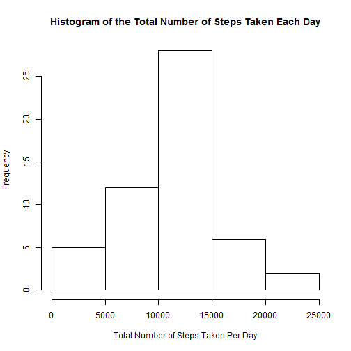
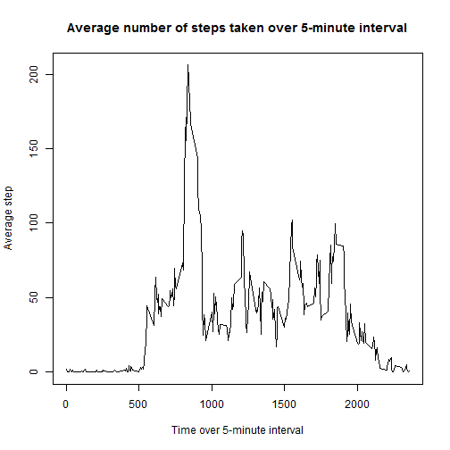
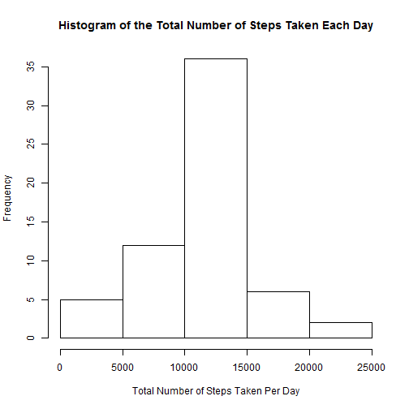
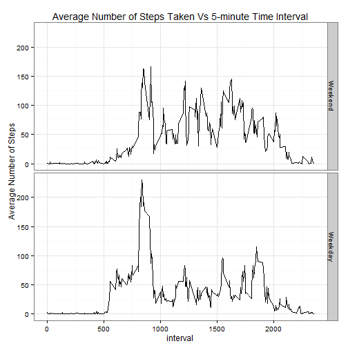

## Loading and preprocessing the data

Below is the code to change the working directory and load the data. There is no need to process 
the data at this initial stage as the data set appears to be tidy.


```r
setwd("C:/Users/leefah/RepData_PeerAssessment1")
dat<-read.csv("activity.csv", header=T, stringsAsFactors=F)
```


## What is mean total number of steps taken per day?

The total number of steps taken per day is given in the table below:


```r
## Compute the total number of steps taken per day using the aggregate function.
totalStep<-with(dat, aggregate(steps, by=list(date=factor(date)), FUN=sum))
names(totalStep)<-c("Date","TotalSteps")
totalStep
```

```
##          Date TotalSteps
## 1  2012-10-01         NA
## 2  2012-10-02        126
## 3  2012-10-03      11352
## 4  2012-10-04      12116
## 5  2012-10-05      13294
## 6  2012-10-06      15420
## 7  2012-10-07      11015
## 8  2012-10-08         NA
## 9  2012-10-09      12811
## 10 2012-10-10       9900
## 11 2012-10-11      10304
## 12 2012-10-12      17382
## 13 2012-10-13      12426
## 14 2012-10-14      15098
## 15 2012-10-15      10139
## 16 2012-10-16      15084
## 17 2012-10-17      13452
## 18 2012-10-18      10056
## 19 2012-10-19      11829
## 20 2012-10-20      10395
## 21 2012-10-21       8821
## 22 2012-10-22      13460
## 23 2012-10-23       8918
## 24 2012-10-24       8355
## 25 2012-10-25       2492
## 26 2012-10-26       6778
## 27 2012-10-27      10119
## 28 2012-10-28      11458
## 29 2012-10-29       5018
## 30 2012-10-30       9819
## 31 2012-10-31      15414
## 32 2012-11-01         NA
## 33 2012-11-02      10600
## 34 2012-11-03      10571
## 35 2012-11-04         NA
## 36 2012-11-05      10439
## 37 2012-11-06       8334
## 38 2012-11-07      12883
## 39 2012-11-08       3219
## 40 2012-11-09         NA
## 41 2012-11-10         NA
## 42 2012-11-11      12608
## 43 2012-11-12      10765
## 44 2012-11-13       7336
## 45 2012-11-14         NA
## 46 2012-11-15         41
## 47 2012-11-16       5441
## 48 2012-11-17      14339
## 49 2012-11-18      15110
## 50 2012-11-19       8841
## 51 2012-11-20       4472
## 52 2012-11-21      12787
## 53 2012-11-22      20427
## 54 2012-11-23      21194
## 55 2012-11-24      14478
## 56 2012-11-25      11834
## 57 2012-11-26      11162
## 58 2012-11-27      13646
## 59 2012-11-28      10183
## 60 2012-11-29       7047
## 61 2012-11-30         NA
```

The histogram displaying the total number of steps taken each day.


```r
hist(totalStep$TotalSteps, main="Histogram of the Total Number of Steps Taken Each Day", xlab="Total Number of Steps Taken Per Day")
```

 


```r
## Compute the mean and median of total number of steps per day.
avgstep<-mean(totalStep$TotalSteps, na.rm=T)
ravg<-round(avgstep, digits=2)
medstep<-median(totalStep$TotalSteps, na.rm=T)
```
The mean and median total number of steps taken per day are 1.076619 &times; 10<sup>4</sup> and 10765 respectively.


## What is the average daily activity pattern?

The average number of steps taken on the 5-minute interval across all days was computed using the following:


```r
## Compute the average number of steps taken on the 5-minute interval across all days.
stepint<-with(dat, aggregate(steps, by=list(interval), FUN=mean, na.rm=T))
names(stepint)<-c("interval", "steps")
```

The time series graph is plotted below:


```r
with(stepint, plot(interval, steps, type="l",main="Average number of steps taken over 5-minute interval",
xlab="Time over 5-minute interval", ylab="Average step"))
```

 

On average across all the days in the dataset, the maximum number of steps occurred on the 5-minute interval beginning


```r
stepint[stepint$steps==max(stepint$steps),1]
```

```
## [1] 835
```


## Imputing missing values

The total number of missing values for each column are given below:


```r
apply(apply(dat,2,is.na),2,sum)
```

```
##    steps     date interval 
##     2304        0        0
```

**Strategy to fill in all the missing values in the dataset**

Assuming that, on the average, activities are consistent throughout the day, the missing values in a
particular 5-minute interval could be replaced by the mean for that 5-minute interval. Using "interval" 
as a identity, missing values are replaced by the average step values from the data frame stepint. Code is below:


```r
dat2<-dat
dat2$steps[is.na(dat2$steps)]<-stepint$steps[match(dat2$interval[is.na(dat2$steps)],stepint$interval)]
```

Compute the total number of steps taken each day with the new dataset.


```r
## Compute the total number of steps taken per day using the aggregate function.
totalStep2<-with(dat2, aggregate(steps, by=list(date=factor(date)), FUN=sum))
names(totalStep2)<-c("Date","TotalSteps")
```


The histogram displaying the total number of steps taken each day.


```r
hist(totalStep2$TotalSteps, main="Histogram of the Total Number of Steps Taken Each Day", xlab="Total Number of Steps Taken Per Day")
```

 


```r
## Compute the mean and median of total number of steps per day for the complete dataset.
avgstep2<-mean(totalStep2$TotalSteps, na.rm=T)
ravg2<-round(avgstep2, digits=2)
medstep2<-median(totalStep2$TotalSteps, na.rm=T)
```
The mean and median total number of steps taken per day for the complete dataset are 1.076619 &times; 10<sup>4</sup> and 
1.0766189 &times; 10<sup>4</sup> respectively.

There is no difference in the mean total number of steps taken per day for the both datasets. This is to be 
expected when replacing missing values by the mean for each 5-minute interval. HOwever, there is a slight
difference in the medians; the median for the dataset with missing values is slightly lower. This difference
is hardly significant. 

Imputing missing data does not change the mean of the total daily number of steps; the shape of the data
distribution remains unchanged as well, as can be observed from both histograms. However, there is an
increase in the frequencies of the histogram, notably in the third class (from 10000 - 15000).


## Are there differences in activity patterns between weekdays and weekends?

Create a day variable using the weekdays function and subsequently a factor variable, "dayend" with 2 levels - "weekday" and "weekend".


```r
## Create a day variable to identify day of the week.
dat2$day<-weekdays(as.Date(dat2$date))
## Converting weekdays to 1 and weekend to 0 and creating a factor variable with 2 levels - weekend and weekday.
dat2$wdayend<-ifelse(dat2$day %in% c("Saturday","Sunday"),0,1)
dat2$wdayend<-factor(dat2$wdayend)
levels(dat2$wdayend)<-c("Weekend","Weekday")
```

The average number of steps taken on the 5-minute interval across all weekday days or weekend days was 
computed using the following:


```r
## Compute the average number of steps taken on the 5-minute interval across all weekday days or weekend days.
stepday<-with(dat2, aggregate(steps, by=list(interval,wdayend), FUN=mean))
names(stepday)<-c("interval", "wdayend","steps")
```
Panel plot containing a time series plot of the average number of steps taken, averaged across all weekday
days or weekend days against the 5-minute interval.


```r
library(ggplot2)
g<-ggplot(stepday, aes(interval,steps))
g+geom_line() +facet_grid(wdayend~.)+ theme_bw()+
labs(title="Average Number of Steps Taken Vs 5-minute Time Interval",y="Average Number of Steps")
```

 


